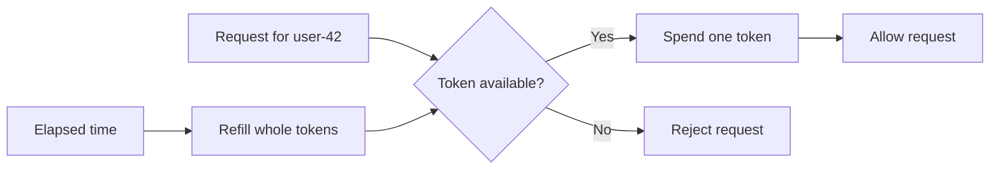
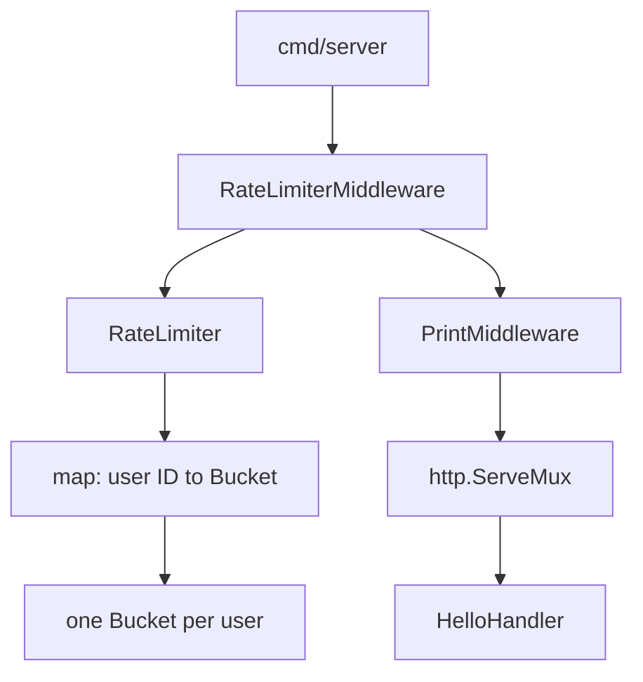
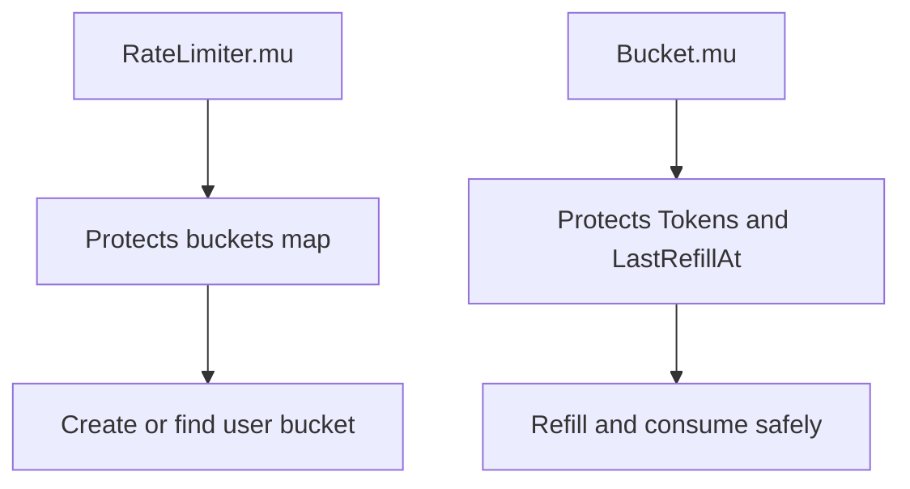

# V1: In-Memory Token Bucket

> Scope: this note documents the archived first version in [`project_archives/v1_in_memory_rate_limiter`](../../project_archives/v1_in_memory_rate_limiter). V2 replaces its map with SQLite.

## Quick revision

- One `RateLimiter` owns a map of `user ID → *Bucket`.
- One `Bucket` holds a user's remaining tokens and refill time.
- The limiter mutex protects the map; the bucket mutex protects its mutable state.
- `Allow(key)` creates a bucket when needed, refills it, then spends one token.

## What problem does a token bucket solve?

It limits the average request rate while allowing a short burst. A bucket starts full, a request spends one token, and time puts tokens back up to a maximum capacity.



### Example

For `Capacity: 3` and `TokensPerSecond: 1`:

| Time | Event | Tokens after event |
| --- | --- | --- |
| 0 s | bucket is created | 3 |
| 0 s | request allowed | 2 |
| 0 s | request allowed | 1 |
| 0 s | request allowed | 0 |
| 0 s | next request rejected | 0 |
| 1 s later | one token is refilled; request allowed | 0 |

### Variation: capacity vs refill rate

`Capacity` controls the burst size. `TokensPerSecond` controls the steady rate.

```go
// Small bursts, quick recovery.
Config{Capacity: 2, TokensPerSecond: 10}

// Larger bursts, slower recovery.
Config{Capacity: 100, TokensPerSecond: 1}
```

## The v1 structure

```text
cmd/server/          starts the HTTP server and builds the handler chain
internal/limiter/    token-bucket types and rate-limit middleware
internal/logger/     request-printing middleware
```



## The core types

```go
type Config struct {
    Capacity        int
    TokensPerSecond float64
}

type RateLimiter struct {
    config  Config
    buckets map[string]*Bucket
    mu      sync.RWMutex
}

type Bucket struct {
    Tokens          int
    Capacity        int
    TokensPerSecond float64
    LastRefillAt    time.Time
    mu              sync.Mutex
}
```

`Config.Validate` rejects non-positive capacity and refill rates before a limiter is constructed.

## Why are there two mutexes?

They protect different shared resources. A single global mutex would work, but it would unnecessarily block requests for different users while one bucket is being refilled.



| Situation | Lock needed | Why |
| --- | --- | --- |
| Look up or add a user bucket | `RateLimiter.mu` | Go maps are not safe for concurrent writes. |
| Change tokens for one user | `Bucket.mu` | Two requests must not spend the same token. |

## A useful mental model

The limiter manages **which bucket** belongs to a user. The bucket manages **how many tokens** that user has. Keeping those jobs separate is what makes the v1 design easy to reason about.

Next: [HTTP handlers and `HandlerFunc`](./1_http_handler_and_handler_func.md).
