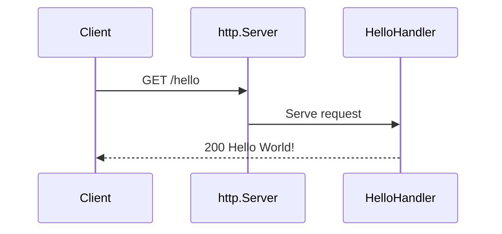

# V1: HTTP Handlers and `HandlerFunc`

## Quick revision

- An HTTP handler is anything with `ServeHTTP(http.ResponseWriter, *http.Request)`.
- A route function has the same parameters but is not itself a `Handler`.
- `http.HandlerFunc` adapts such a function into a `Handler`.
- `ServeMux` matches a path and calls its handler.

## The two values every handler receives

```go
func HelloHandler(w http.ResponseWriter, r *http.Request) {
    fmt.Fprintln(w, "Hello World!")
}
```

`r` contains what the client sent: method, path, headers, body, and more. `w` is where the handler writes the HTTP response.



## `http.Handler`

The standard-library interface is deliberately small:

```go
type Handler interface {
    ServeHTTP(http.ResponseWriter, *http.Request)
}
```

Go uses implicit interface satisfaction. A type does not declare that it implements `http.Handler`; it simply needs a matching method.

```go
type StatusHandler struct{}

func (StatusHandler) ServeHTTP(w http.ResponseWriter, r *http.Request) {
    w.WriteHeader(http.StatusNoContent)
}
```

`StatusHandler` is now an `http.Handler`.

## Why `HandleFunc` accepts a normal function

`HelloHandler` is a function, not a struct with methods. `http.HandlerFunc` is the adapter that makes it fit the interface.

```go
type HandlerFunc func(http.ResponseWriter, *http.Request)

func (f HandlerFunc) ServeHTTP(w http.ResponseWriter, r *http.Request) {
    f(w, r)
}
```

So this convenient route registration:

```go
mux.HandleFunc("/hello", HelloHandler)
```

is conceptually the same as:

```go
mux.Handle("/hello", http.HandlerFunc(HelloHandler))
```


## Variations

Use `HandleFunc` when the handler is just a function:

```go
mux.HandleFunc("/health", func(w http.ResponseWriter, r *http.Request) {
    fmt.Fprintln(w, "ok")
})
```

Use `Handle` when you already have a value implementing `http.Handler`:

```go
mux.Handle("/status", StatusHandler{})
```

## Check yourself

Why can both `StatusHandler{}` and `HelloHandler` be registered on a `ServeMux`? They both become `http.Handler` values—one through a method, the other through `http.HandlerFunc`.

Next: [how middleware also becomes a handler](./2_understand_middleware.md).
