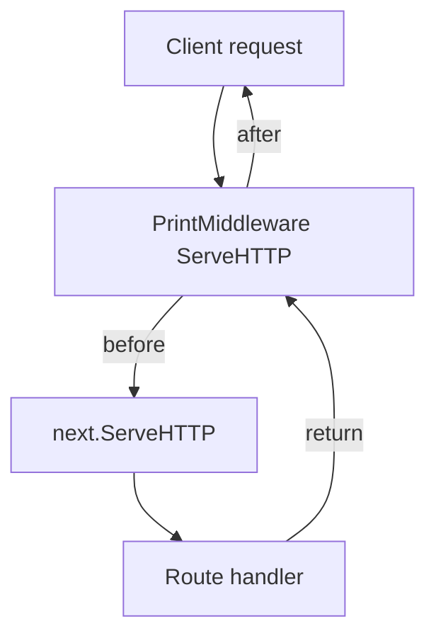
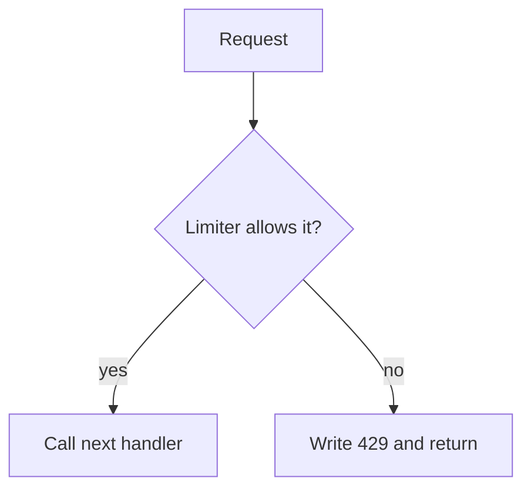

# V1: Middleware Is a Handler That Wraps Another Handler

## Quick revision

- Middleware implements `http.Handler`.
- It stores the next handler in the chain.
- It can run code before and after `next.ServeHTTP`.
- It can stop the request by writing a response and returning.

## The smallest useful shape

```go
type PrintMiddleware struct {
    next http.Handler
}

func (p *PrintMiddleware) ServeHTTP(w http.ResponseWriter, r *http.Request) {
    fmt.Println("before")
    p.next.ServeHTTP(w, r)
    fmt.Println("after")
}
```

The `next` field is `http.Handler`, not `*http.ServeMux`. That is important: the next item might be a router, a route function adapted with `HandlerFunc`, or another middleware.



## Allow-or-stop variation

Rate limiting uses the same structure, but conditionally calls `next`.

```go
func (m *RateLimiterMiddleware) ServeHTTP(w http.ResponseWriter, r *http.Request) {
    if !m.limiter.Allow(r.Header.Get("X-User-ID")) {
        http.Error(w, "Rate limit exceeded", http.StatusTooManyRequests)
        return
    }
    m.next.ServeHTTP(w, r)
}
```



## Ordering matters

The outermost middleware runs first.

```go
logging := logger.PrintMiddlewareHandler(mux)
rateLimited, _ := limiter.NewRateLimiterMiddleware(logging, config)
```

This creates:

```text
Rate limiter → logger → router → route
```

Therefore, a rate-limited request does not reach the logger or route in v1. Reverse the wrapping order if logging every attempted request is the requirement.

## Check yourself

The server only sees one `http.Handler`: the outermost one. Each layer decides whether to call the next layer.

Next: [build the simplest logging middleware](./3_write_these_before_middleware.md).
