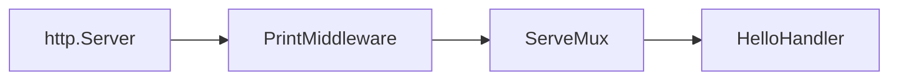
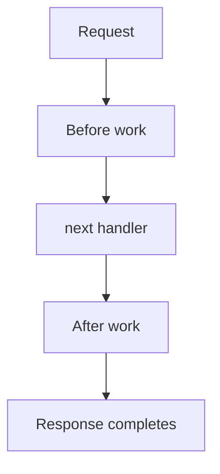

# V1: Build a Middleware Before Reading the Final Version

## Quick revision

To build middleware, store `next http.Handler`, implement `ServeHTTP`, and call `next.ServeHTTP` when the request should continue.

## Start with one observable action

```go
type PrintMiddleware struct {
    next http.Handler
}

func (p *PrintMiddleware) ServeHTTP(w http.ResponseWriter, r *http.Request) {
    fmt.Printf("%s %s\n", r.Method, r.URL.Path)
    p.next.ServeHTTP(w, r)
}
```

Wire it around a router:

```go
mux := http.NewServeMux()
mux.HandleFunc("/hello", HelloHandler)

handler := &PrintMiddleware{next: mux}
server := &http.Server{Addr: ":9090", Handler: handler}
```



## What to observe

Run the server and request the route:

```bash
curl http://localhost:9090/hello
```

The terminal prints `GET /hello`; the client receives `Hello World!`. This proves the middleware ran and still forwarded the request.

## Variations

**Before only**: request logging, authentication, and rate limiting normally make their decision before `next`.

```go
if r.Header.Get("Authorization") == "" {
    http.Error(w, "unauthorized", http.StatusUnauthorized)
    return
}
p.next.ServeHTTP(w, r)
```

**Before and after**: timing middleware measures the whole downstream request.

```go
start := time.Now()
p.next.ServeHTTP(w, r)
fmt.Println("duration:", time.Since(start))
```



## Common mistake

If `next.ServeHTTP` is omitted, the route never runs. That is correct only for an intentional rejection path.

Next: [the v1 logging middleware](./4_build_logging_middleware.md).
