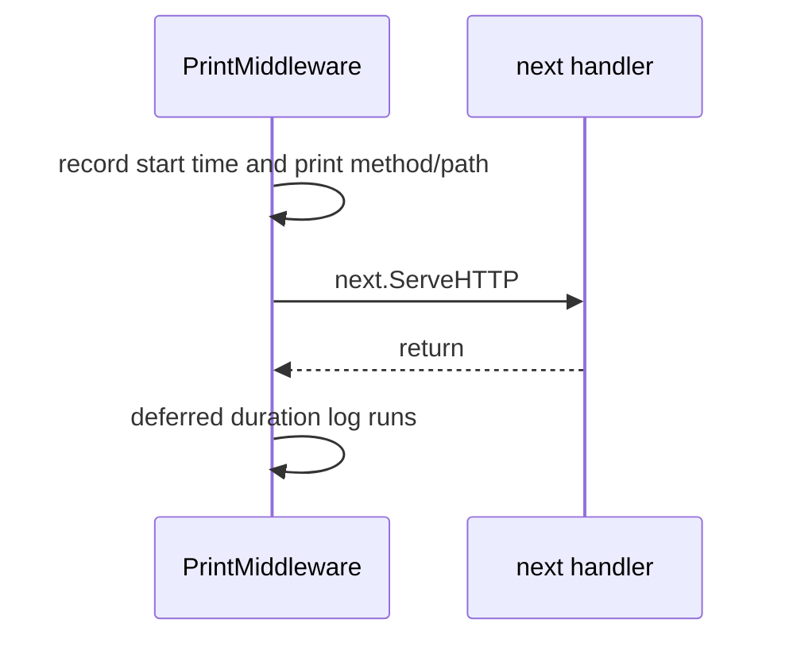

# V1: Logging Middleware

## Quick revision

The v1 logger prints the request method/path before the route runs and prints the total duration after it returns.

## The v1 implementation

```go
func (p *PrintMiddleware) ServeHTTP(w http.ResponseWriter, r *http.Request) {
    start := time.Now()
    fmt.Printf("%s %s\n", r.Method, r.URL.Path)

    defer func() {
        fmt.Println("Request Duration:", time.Since(start))
    }()

    p.next.ServeHTTP(w, r)
}
```

`defer` schedules the duration log for the moment `ServeHTTP` returns. It makes the "after" action stay paired with the "before" action.



## Constructor

```go
func PrintMiddlewareHandler(next http.Handler) *PrintMiddleware {
    return &PrintMiddleware{next: next}
}
```

It takes a handler and returns a new handler, which is the usual middleware composition pattern.

## Example output

```text
========== Incoming Request ==========
GET /hello
======================================
Inside
Request Duration: 42.1µs
```

## Variations

To add the response status code, wrap `http.ResponseWriter` and record calls to `WriteHeader`. That is a separate concern from this learning version.

To log every request, place logging outside the rate limiter:

```go
rateLimited, _ := limiter.NewRateLimiterMiddleware(mux, config)
handler := logger.PrintMiddlewareHandler(rateLimited)
```


The archived v1 wiring instead puts the limiter outside the logger, so rejected requests are not logged by `PrintMiddleware`.

Next: [the rate-limit middleware integration](./5_build_rate_limit_middleware.md).
