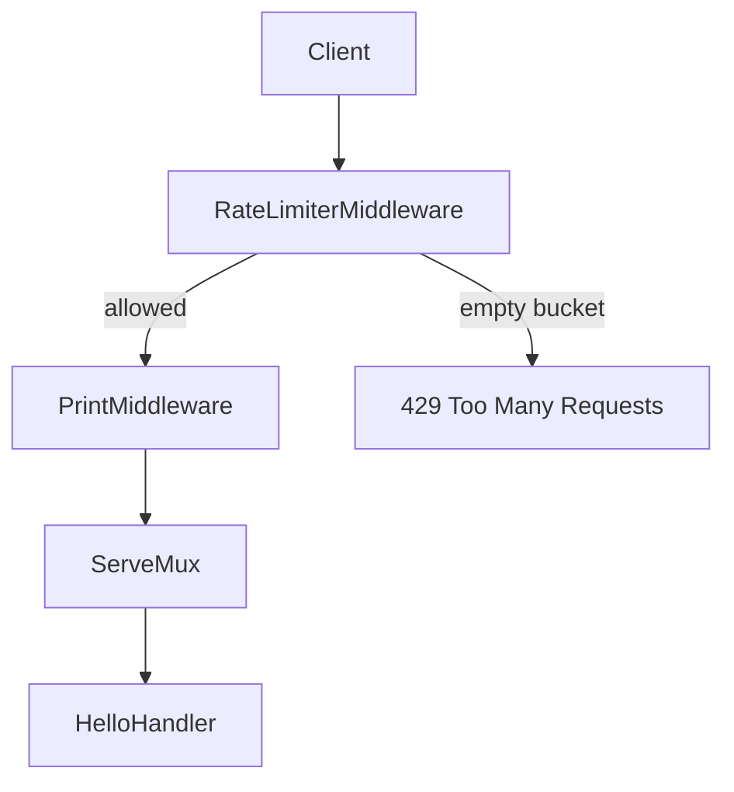
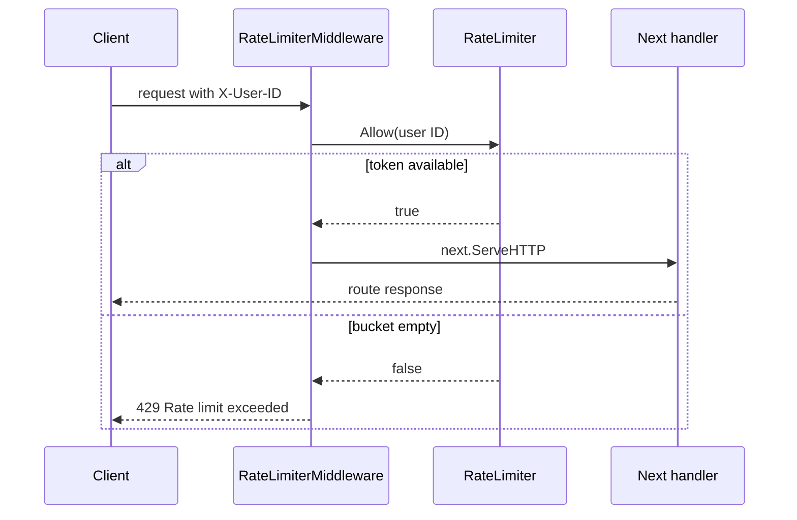

# V1: Rate-Limit Middleware Integration

## Quick revision

- Construct one limiter at startup, not one per request.
- Use a stable request key; v1 uses `X-User-ID`.
- Call `Allow(key)` once per request.
- Return HTTP 429 when no token is available; otherwise forward to `next`.

## Build the handler chain

The archived v1 server creates routes first, then wraps them:

```go
mux := http.NewServeMux()
mux.HandleFunc("/hello", HelloHandler)

config := limiter.Config{Capacity: 100, TokensPerSecond: 1.67}
logging := logger.PrintMiddlewareHandler(mux)
rateLimited, err := limiter.NewRateLimiterMiddleware(logging, config)
```



## Construct the limiter once

```go
func NewRateLimiterMiddleware(next http.Handler, config Config) (http.Handler, error) {
    limiter, err := NewRateLimiter(config)
    if err != nil {
        return nil, err
    }
    return &RateLimiterMiddleware{limiter: limiter, next: next}, nil
}
```

This is called while wiring the server. Its `RateLimiter` and bucket map live across requests.

### Incorrect variation

Do not create the limiter inside `ServeHTTP`:

```go
// Wrong: every request starts with a fresh, full map.
limiter, _ := NewRateLimiter(config)
```

That would prevent the limiter from remembering previous requests.

## Request decision

```go
func (m *RateLimiterMiddleware) ServeHTTP(w http.ResponseWriter, r *http.Request) {
    key := r.Header.Get("X-User-ID")
    if !m.limiter.Allow(key) {
        http.Error(w, "Rate limit exceeded", http.StatusTooManyRequests)
        return
    }
    m.next.ServeHTTP(w, r)
}
```



## Key variations

The key determines who shares a bucket:

| Key | Useful when | Caveat |
| --- | --- | --- |
| `X-User-ID` | an authenticated system has user IDs | header must be trusted/validated in production |
| API key | clients are identified by keys | do not log secrets |
| IP address | no authentication exists | multiple users can share one public IP |

V1 uses a header to make testing simple:

```bash
curl -H 'X-User-ID: alice' http://localhost:9090/hello
```

## Final recall

The route does not know rate limiting exists. The middleware decides whether the route receives a request, and `RateLimiter` owns the token-bucket state. That separation is the main design lesson from v1.
