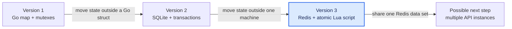
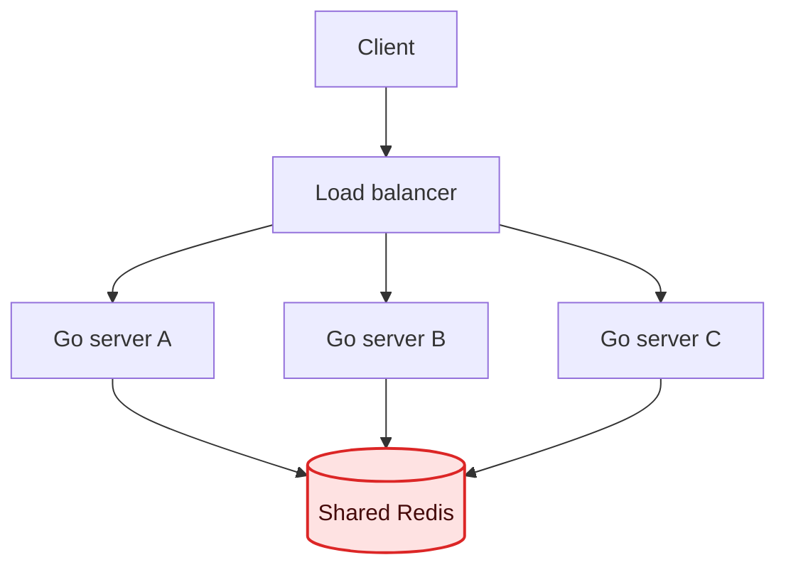
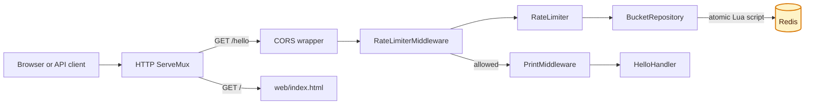
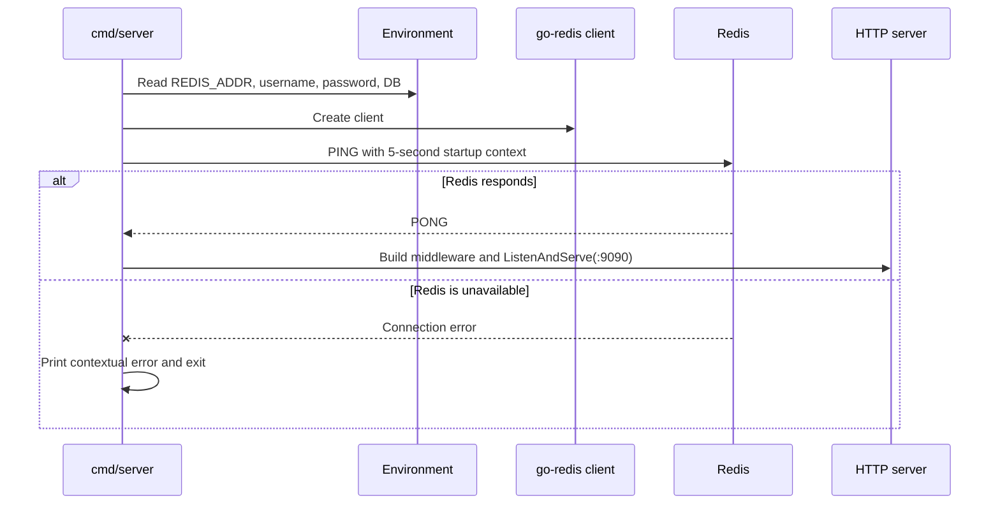
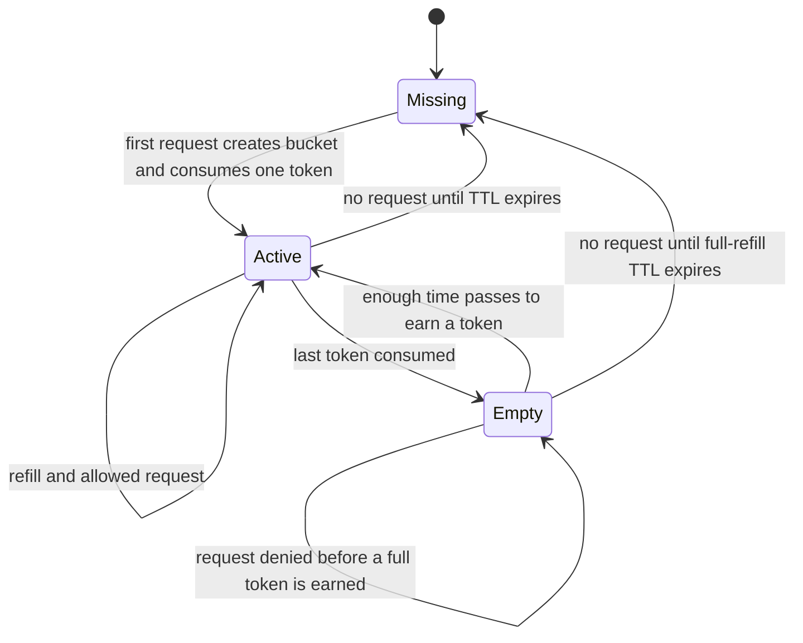

# Redis Rate Limiter — Version 3 Architecture

> **Current version:** Redis-backed token bucket  
> **Previous version:** SQLite-backed token bucket  
> **Main goal:** let several Go processes safely share the same rate-limit state

## Documentation map

| Guide | What it explains |
| --- | --- |
| **1. Architecture — this page** | Why Redis was introduced, package boundaries, stored data, and startup lifecycle |
| [2. Atomic token-bucket algorithm](1_atomic_token_bucket_algorithm.md) | The refill maths, Lua script, race prevention, expiry, and worked examples |
| [3. Running, testing, and observing](2_request_flow_running_and_testing.md) | HTTP flow, Docker commands, Redis inspection, tests, troubleshooting, and production notes |

## The learning path

The rate-limit rule stays the same in every version. What changes is where the bucket state lives and how concurrent requests update it safely.



| Version | Source of truth | Concurrency protection | Can separate servers share limits? |
| --- | --- | --- | --- |
| In memory | A Go map in one process | Go mutexes | No |
| SQLite | A local `.db` file | SQL transaction | Normally no |
| Redis | Keys in a Redis server | One atomic Lua script | Yes, when they use the same Redis instance |

The completed older implementations are preserved under `project_archives/`. The repository root contains the current version.

## What problem Redis solves

With in-memory storage, restarting the Go process removes every bucket. A second server also gets a completely different map.

SQLite makes bucket data durable on one machine, but the database file is still local. If two API servers use two different files, a user effectively gets two separate limits.

Redis gives all application instances one shared location:



This repository currently starts one Go server, but its bucket operation is designed so additional servers can use the same Redis keys safely.

## Current application architecture

The HTTP layer does not know how Redis fields are calculated. The Redis package does not know anything about HTTP headers. Each layer has one main responsibility.



### Package responsibilities

| Location | Responsibility | Deliberately does not do |
| --- | --- | --- |
| `cmd/server/main.go` | Opens Redis, builds the handler, and starts the HTTP server | Calculate tokens |
| `cmd/server/routes.go` | Defines routes, middleware order, capacity, and refill rate | Execute Redis commands |
| `internal/redis/redis.go` | Reads connection settings, creates the client, and checks `PING` | Know about buckets or HTTP |
| `internal/limiter/config.go` | Validates capacity and refill rate | Store mutable state |
| `internal/limiter/middleware.go` | Reads `X-User-ID` and converts decisions into HTTP responses | Implement the refill maths |
| `internal/limiter/limiter.go` | Provides the rate-limiter application boundary | Know the Redis key format |
| `internal/repository/bucket.go` | Owns the key format and atomic bucket operation | Know about status codes |

This separation makes future changes smaller. For example, adding response headers belongs in the middleware, while changing the stored bucket format belongs in the repository.

## Startup lifecycle

Redis is an application dependency, so the server checks it before accepting HTTP traffic.



Opening the client once is important. The same concurrency-safe client and its connection pool are reused for all requests. A new Redis client is not created inside `ServeHTTP`.

## How one user is stored

The value of `X-User-ID` becomes the final part of a namespaced Redis key.

```text
Header: X-User-ID: ramu

Redis key: rate-limiter:bucket:ramu
Redis type: hash
```

The hash has two fields:

| Field | Example | Meaning |
| --- | ---: | --- |
| `tokens` | `73` | Whole tokens available after the latest decision |
| `last_refill_at` | `1790407907362.42` | Redis time in milliseconds, including saved partial refill progress |

An example from `redis-cli` looks like this:

```text
127.0.0.1:6379> HGETALL rate-limiter:bucket:ramu
1) "tokens"
2) "73"
3) "last_refill_at"
4) "1790407907362.42"
```

Why a Redis hash instead of two unrelated keys?

- Both fields describe one bucket.
- The script can read them together with `HMGET`.
- Redis can expire the whole bucket with one TTL.
- The key namespace is easy to inspect without mixing it with other application data.

## Bucket lifecycle



A missing bucket is treated as full. Therefore, deleting an inactive key after it has had enough time to refill does not change the rate-limit result.

## Configuration used by this project

The current values live in `cmd/server/routes.go`:

| Setting | Value | Effect |
| --- | ---: | --- |
| Capacity | `100` tokens | A new or fully refilled user may burst up to 100 requests |
| Refill rate | `1.67` tokens/second | Roughly 100 tokens are restored per minute |
| Request cost | `1` token | Every allowed `/hello` request consumes one token |

The approximate time to refill an empty bucket is:

```text
100 / 1.67 = 59.88 seconds
```

That same duration is used as the bucket TTL. The exact calculation and its reason are explained in the [algorithm guide](1_atomic_token_bucket_algorithm.md).

## What “distributed” means here

The bucket update is ready to be shared by multiple Go processes because:

1. Bucket state is outside every Go process.
2. Every process uses the same key naming rule.
3. Redis serializes the Lua operation.
4. Refill time comes from Redis rather than each application's clock.

It does **not** automatically provide a full production deployment. The current Compose file starts one Redis container without authentication or TLS, and the application uses a standard single-node Redis client. Those choices are suitable for local learning, not an internet-facing Redis service.

## Continue reading

Next: [Atomic token-bucket algorithm](1_atomic_token_bucket_algorithm.md)
