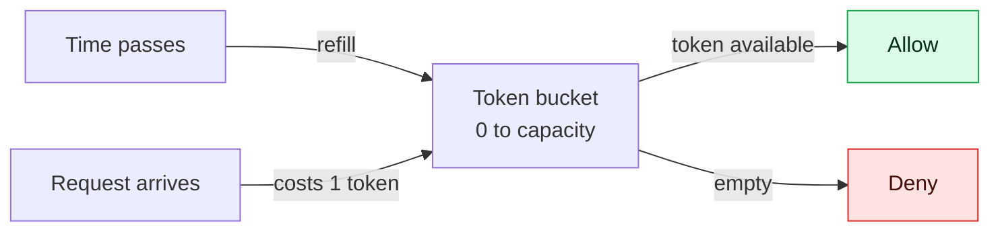
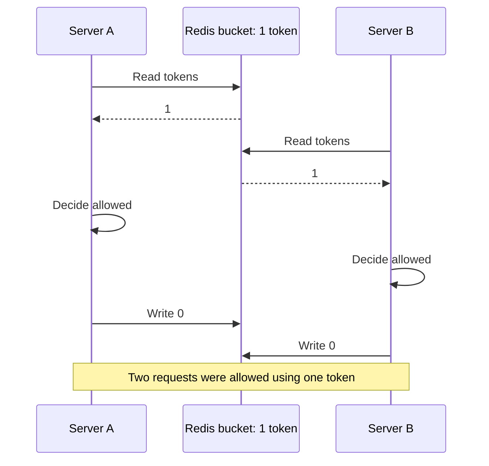
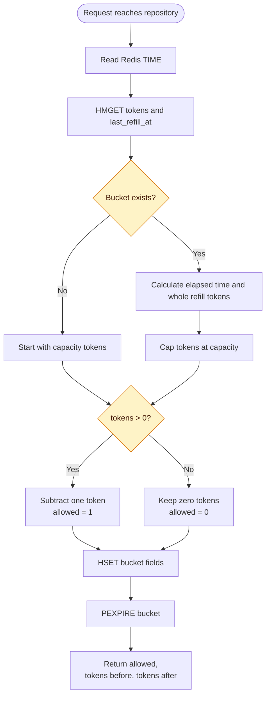
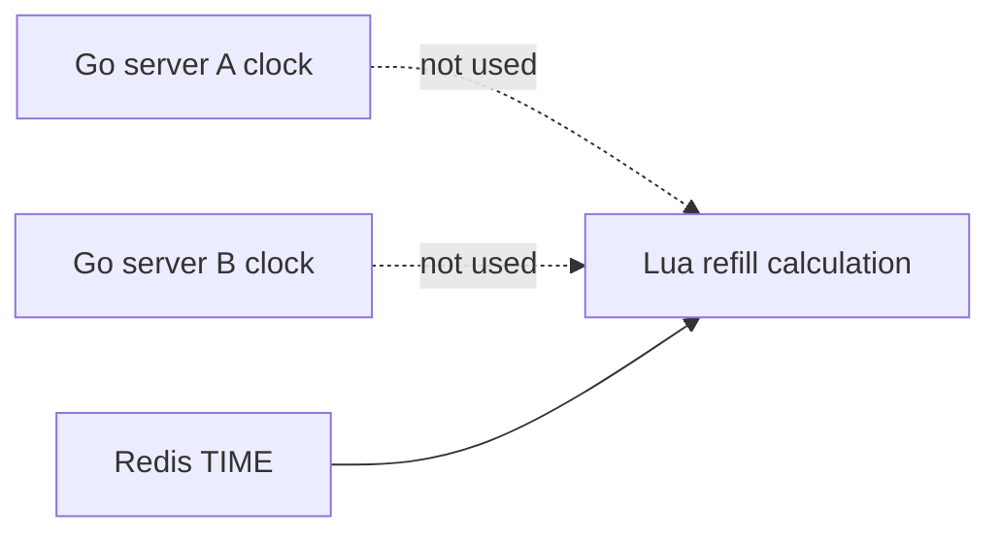
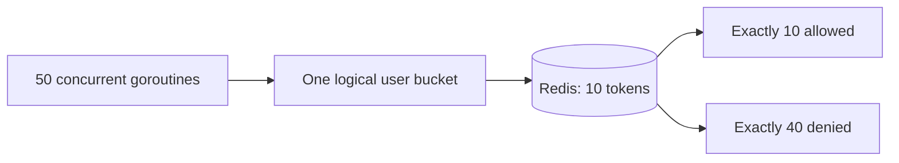

# Atomic Token-Bucket Algorithm in Redis

[← Architecture](0_redis_rate_limiter.md) · [Running and testing →](2_request_flow_running_and_testing.md)

## The bucket model

A token bucket answers one question: **may this request spend one token now?**

Think of it as a container with a fixed maximum size:

- `capacity` is the maximum number of tokens the container can hold.
- `tokens_per_second` controls how quickly tokens return.
- Each allowed request costs one whole token.
- An empty bucket rejects requests until at least one whole token has returned.



The project stores only whole available tokens. Fractional progress is preserved through `last_refill_at` rather than storing a fractional token count.

## The refill maths

For an existing bucket, the Lua script performs these calculations:

```text
elapsed_ms   = max(0, now_ms - last_refill_at)
tokens_to_add = floor(elapsed_ms × tokens_per_second / 1000)
tokens        = min(capacity, tokens + tokens_to_add)
```

The important operations are:

- `floor`: a user must earn a complete token before spending it.
- `min`: tokens never grow above capacity.
- `max(0, ...)`: a backwards clock value cannot remove tokens or create negative elapsed time.

When tokens are added, the stored refill time advances only by the duration represented by those complete tokens:

```text
last_refill_at += tokens_to_add / tokens_per_second × 1000
```

It is intentionally **not** always replaced with `now_ms`. Keeping the unused fraction of time prevents refill progress from being lost.

## Worked refill example

Assume:

```text
capacity = 3 tokens
refill rate = 2 tokens/second
one token takes 500 ms to earn
```

| Time | Elapsed from stored refill time | Refill | Before request | Decision | After request | Stored refill time |
| ---: | ---: | ---: | ---: | --- | ---: | ---: |
| `0 ms` | New bucket | — | 3 | Allowed | 2 | `0 ms` |
| `200 ms` | 200 ms | 0 | 2 | Allowed | 1 | `0 ms` |
| `600 ms` | 600 ms | 1 | 2 | Allowed | 1 | `500 ms` |
| `900 ms` | 400 ms | 0 | 1 | Allowed | 0 | `500 ms` |
| `1000 ms` | 500 ms | 1 | 1 | Allowed | 0 | `1000 ms` |
| `1200 ms` | 200 ms | 0 | 0 | Denied | 0 | `1000 ms` |

At `600 ms`, one token is added and only `500 ms` is applied to `last_refill_at`. The remaining `100 ms` continues toward the next token.

If the script stored `600 ms` instead, that `100 ms` would disappear. Repeated requests could then delay refills indefinitely by constantly discarding partial progress.

## Why separate Redis commands are unsafe

The logical operation is read → calculate → consume → write. Running those as separate client commands creates a race.



A Redis transaction using `WATCH` could solve this with optimistic retries. This project uses a Lua script because the entire decision is small, belongs close to the data, and can complete in one Redis operation.

## The atomic Lua operation

Redis executes the script as one uninterrupted operation. Other commands may run before it or after it, but not halfway through its bucket update.



### Script inputs

The repository supplies one Redis key and three arguments:

| Input | Example | Purpose |
| --- | ---: | --- |
| `KEYS[1]` | `rate-limiter:bucket:ramu` | The only bucket the script may change |
| `ARGV[1]` | `100` | Capacity |
| `ARGV[2]` | `1.67` | Tokens earned per second |
| `ARGV[3]` | `59881` | Bucket expiry in milliseconds |

Keeping the bucket name in `KEYS` and configuration in `ARGV` makes the script reusable for every user.

### Script result

The script returns three integers:

```text
{allowed, tokens_before, tokens_after}
```

Examples:

| Redis result | Go decision | Meaning |
| --- | --- | --- |
| `{1, 8, 7}` | `Allowed: true` | One token was consumed |
| `{0, 0, 0}` | `Allowed: false` | No token was available |

Returning the counts lets the middleware log one internally consistent decision. Version 2 performed extra reads before and after the transaction; another concurrent request could change the bucket between those reads.

## New bucket behavior

When `HMGET` finds no bucket:

1. The script starts with `capacity` tokens.
2. It records the current Redis time.
3. It consumes one token for the current request.
4. It stores `capacity - 1` tokens.

For a capacity of 100, the first request returns:

```text
allowed = 1
tokens_before = 100
tokens_after = 99
```

This avoids a separate “create bucket” request and makes the first real request count toward the limit.

## Why the script uses Redis time

Several Go servers may have slightly different system clocks. If each process supplied its own timestamp, requests routed between servers could refill a bucket too early or too late.

The script calls Redis `TIME`, making Redis the single clock for bucket calculations:



Milliseconds are precise enough for the current whole-token algorithm. The stored timestamp can contain a decimal because advancing it by `tokens_to_add / tokens_per_second` may produce a fractional millisecond.

## Bucket expiry and memory cleanup

The repository calculates the time for an empty bucket to become full:

```text
TTL milliseconds = ceil(capacity / tokens_per_second × 1000)
```

With the current settings:

```text
ceil(100 / 1.67 × 1000) = 59,881 ms
```

After every allowed or denied decision, `PEXPIRE` restarts that TTL.

Why this is behaviorally safe:

1. Suppose a user stops sending requests.
2. By the time the TTL ends, the bucket has had enough time to become full.
3. Redis removes the key.
4. A later request treats the missing bucket as full.

The visible result is the same, but Redis no longer stores inactive users forever.

## Invariants preserved by the script

After every successful script execution:

| Invariant | How it is protected |
| --- | --- |
| Tokens never exceed capacity | `math.min(capacity, ...)` |
| Tokens never become negative | Consume only when `tokens > 0` |
| One request consumes at most one token | A single subtraction is performed |
| One token cannot be spent concurrently twice | Redis executes the script atomically |
| Partial refill time is not discarded | Advance time only for whole tokens added |
| All servers use one refill clock | The script calls Redis `TIME` |
| Inactive buckets do not live forever | `PEXPIRE` is refreshed on each decision |

## Error semantics

The repository returns an error when the script cannot run or returns an unexpected shape. This is different from an empty bucket:

| Repository outcome | HTTP meaning |
| --- | --- |
| `Allowed: true`, no error | Continue to the next handler |
| `Allowed: false`, no error | A valid decision: return `429` |
| Error | No trustworthy decision exists: return `500` |

Failing open would allow unlimited traffic during a Redis outage. Failing closed with `429` would incorrectly tell clients they exceeded their quota. This learning implementation chooses a visible server error instead.

## How atomicity is tested

The integration test creates a bucket with 10 tokens and starts 50 goroutines. All goroutines call the same Redis-backed limiter for the same user.



The refill rate is deliberately tiny during this test so no new token appears while the goroutines are running. If read and write were not atomic, more than 10 requests could be allowed.

## Continue reading

Next: [Request flow, Docker, testing, and troubleshooting](2_request_flow_running_and_testing.md)
