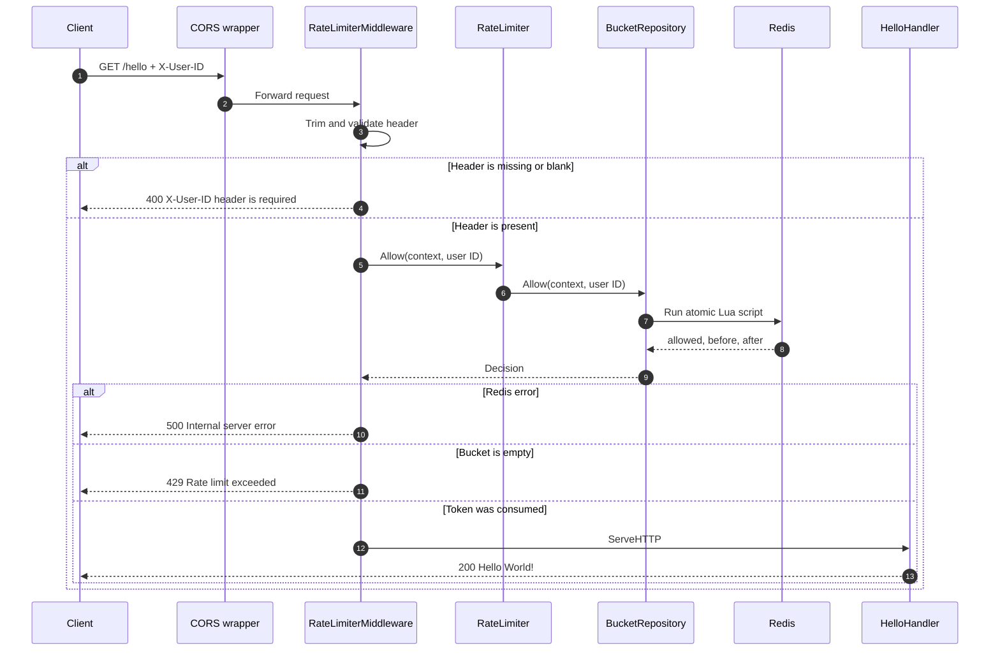
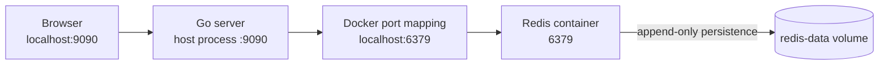
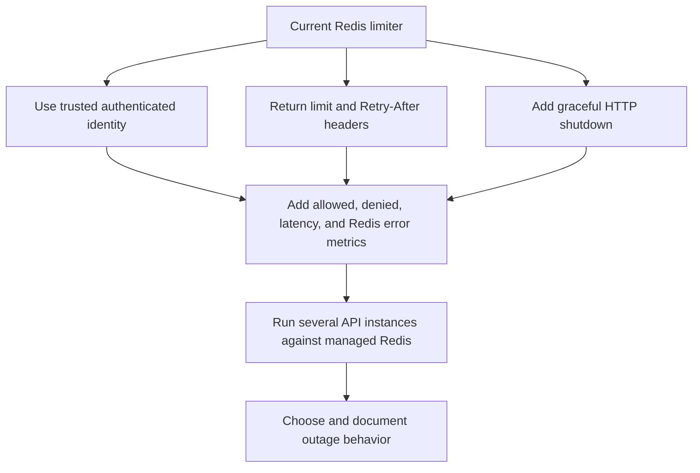

# Request Flow, Running, Testing, and Observing

[← Architecture](0_redis_rate_limiter.md) · [← Atomic algorithm](1_atomic_token_bucket_algorithm.md)

## Complete request flow

The `/hello` route is wrapped in this order:

```text
ServeMux → CORS → RateLimiterMiddleware → PrintMiddleware → HelloHandler
```

Middleware order matters. A rejected request stops at the rate limiter and never reaches the logging middleware or handler.



The request context travels from `http.Request` through the limiter and repository into the Redis command. If the request is cancelled, the Redis operation can also be cancelled.

## HTTP outcomes

| Situation | Status | Body | Was Redis called? | Was the handler called? |
| --- | ---: | --- | --- | --- |
| Missing or whitespace-only `X-User-ID` | `400` | `X-User-ID header is required` | No | No |
| Token available | `200` | `Hello World!` | Yes | Yes |
| Bucket empty | `429` | `Rate limit exceeded` | Yes | No |
| Redis command fails | `500` | `Internal server error` | Attempted | No |
| Browser CORS preflight | `204` | Empty | No | No |

Internal Redis errors are logged but are not returned to the client. This keeps connection details out of public responses.

## Local system layout

The Go process runs on the host while Docker supplies Redis.



The Compose service contains:

| Setting | Purpose |
| --- | --- |
| `redis:7.4-alpine` | Small pinned Redis image instead of an unpredictable `latest` tag |
| `6379:6379` | Makes Redis reachable from the host Go process |
| `--appendonly yes` | Writes Redis changes to append-only persistence files |
| `redis-data:/data` | Keeps Redis files outside the container filesystem |
| Health check | Waits for `redis-cli ping` to succeed |

## Start the project

### 1. Start Redis

From the repository root:

```powershell
docker compose up -d --wait
```

Confirm that it is healthy:

```powershell
docker compose ps
docker compose exec redis redis-cli PING
```

Expected Redis response:

```text
PONG
```

### 2. Create the local environment file

Copy the tracked example:

```powershell
Copy-Item .env.example .env
```

The repository already includes a local `.env` for development, but this command is what a new clone should use. Edit `.env` if Redis is not using the default address or credentials.

### 3. Start the Go server

```powershell
go run ./cmd/server
```

Expected startup message:

```text
Server is running on port 9090
```

The process first gives Redis five seconds to answer `PING`. If that check fails, the HTTP server does not start.

### 4. Send a request

PowerShell with `curl.exe`:

```powershell
curl.exe -i -H "X-User-ID: ramu" http://localhost:9090/hello
```

Browser demo:

```text
http://localhost:9090
```

The browser chooses a demo user and sends the same `X-User-ID` header to `/hello`.

## Redis connection configuration

The server calls `godotenv.Load()` before creating the Redis client. This loads values from the root `.env` file. Variables already defined by the operating system are not overwritten, which makes deployment-level configuration take priority over local defaults.

All settings are optional for local development.

| Environment variable | Default | Example | Meaning |
| --- | --- | --- | --- |
| `REDIS_ADDR` | `localhost:6379` | `redis.internal:6379` | Redis host and port |
| `REDIS_USERNAME` | Empty | `rate-limiter` | ACL username |
| `REDIS_PASSWORD` | Empty | `secret` | Password or ACL secret |
| `REDIS_DB` | `0` | `2` | Logical Redis database number |

Example for PowerShell:

```powershell
$env:REDIS_ADDR = "localhost:6379"
$env:REDIS_DB = "0"
go run ./cmd/server
```

`REDIS_DB` must be a non-negative integer. Invalid input is rejected during startup instead of silently connecting to the wrong database.

### Files and Git behavior

| File | Committed? | Purpose |
| --- | --- | --- |
| `.env.example` | Yes | Documents every required setting with safe local defaults |
| `.env` | No | Holds settings or credentials for one developer's machine |

When a new setting is introduced, add its name and a safe placeholder to `.env.example`. Put real secrets only in `.env` or in the deployment environment.

## Watch the bucket change

Use one terminal for the Go server and another for Redis inspection.

### Find bucket keys

```powershell
docker compose exec redis redis-cli --scan --pattern "rate-limiter:bucket:*"
```

`SCAN` is used instead of `KEYS` because it does not ask Redis to return the entire keyspace in one blocking operation.

### Read one bucket

```powershell
docker compose exec redis redis-cli HGETALL "rate-limiter:bucket:ramu"
```

### Check its remaining lifetime

```powershell
docker compose exec redis redis-cli PTTL "rate-limiter:bucket:ramu"
```

The result is milliseconds:

- A positive number is the remaining lifetime.
- `-1` means the key exists without an expiry.
- `-2` means the key does not exist, usually because it expired or has never been used.

### Observe commands while learning

In a separate terminal:

```powershell
docker compose exec redis redis-cli MONITOR
```

Then send a few HTTP requests. `MONITOR` is useful for local learning but is expensive and should not be left running on a busy production server.

## See the limit happen quickly

The production demo configuration has 100 tokens, so a short loop is useful:

```powershell
$user = "demo-" + [DateTimeOffset]::UtcNow.ToUnixTimeMilliseconds()
1..120 | ForEach-Object {
    curl.exe -s -o NUL -w "%{http_code}`n" `
        -H "X-User-ID: $user" `
        http://localhost:9090/hello
}
```

You will first see `200` responses and later `429` responses. Because the loop takes time and the refill rate is 1.67 tokens per second, a few new tokens may appear while the loop is running. Therefore, the total number of `200` responses may be slightly greater than 100.

## Automated tests

### Normal test run

```powershell
go test ./...
go vet ./...
```

When `REDIS_TEST_ADDR` is missing, Redis integration tests are skipped. Configuration tests still run, and all packages are compiled.

### Docker-backed integration run

```powershell
docker compose up -d --wait
$env:REDIS_TEST_ADDR = "localhost:6379"
go test -count=1 -v ./...
go vet ./...
```

The tests connect to logical Redis database 15, while the application defaults to database 0. Each test also creates a unique user ID and deletes only its own key during cleanup.

### What the tests prove

| Test behavior | Why it matters |
| --- | --- |
| A missing bucket reports full capacity | New users begin with the configured allowance |
| Two available tokens allow two requests | Normal consumption works |
| The third request is denied | Tokens cannot become negative |
| Redis really stores zero tokens | Redis is the source of truth, not hidden Go memory |
| Moving refill time backward restores tokens | Refill maths works |
| 50 goroutines compete for 10 tokens | The Lua update remains atomic under concurrency |
| Invalid configuration returns an error | Bad limits fail at startup |

The concurrency assertion is especially important: exactly 10 of the 50 requests must succeed. A result above 10 would expose a read-modify-write race.

## Persistence and reset behavior

| Command | Container | Named volume | Bucket data |
| --- | --- | --- | --- |
| `docker compose stop` | Stopped, not removed | Kept | Kept |
| `docker compose down` | Removed | Kept | Kept |
| `docker compose down -v` | Removed | Removed | Reset |

Individual inactive buckets still expire according to their own TTL. The volume preserves Redis data across container replacement; it does not override key expiry.

## Troubleshooting

| Symptom | Likely cause | Check or fix |
| --- | --- | --- |
| `connect to Redis ... connection refused` | Container is stopped or port 6379 is unavailable | Run `docker compose ps` and `docker compose up -d --wait` |
| Port 6379 is already allocated | Another Redis or container owns the port | Run `docker ps` and either reuse that Redis or change the Compose and `REDIS_ADDR` ports |
| Server exits before printing its port | Startup `PING` failed | Read the complete startup error and verify credentials/address |
| Every request gets `400` | `X-User-ID` is missing or only spaces | Send `-H "X-User-ID: some-user"` |
| A user immediately receives `429` after restart | Redis and its volume preserved the bucket | Wait for refill, use another user, or intentionally reset the data |
| Test says it was skipped | `REDIS_TEST_ADDR` is not set | Set it before `go test` |
| Test connects but app data is not visible | Tests use database 15; app uses database 0 | Pass `-n 15` to `redis-cli` when inspecting tests |
| `PTTL` returns `-2` | Key expired or never existed | Send one request for that exact user ID |

Useful container logs:

```powershell
docker compose logs redis
```

## Current security boundary

`X-User-ID` is accepted directly from the caller. That is fine for this demo, but it is not an identity system. In a real API, a client could change the header and receive a fresh bucket.

A production service should derive the limiter key from trusted authentication data, such as a verified account ID, API key ID, or tenant ID.

The local Compose Redis also has no password or TLS. Keep port 6379 local. A deployed Redis should be placed on a private network and configured with the authentication and encryption appropriate for its environment.

## Good next improvements



Possible production work includes:

1. Use a verified identity instead of trusting a public header.
2. Add `RateLimit-*` and `Retry-After` response headers.
3. Add HTTP read, write, idle, and graceful-shutdown timeouts.
4. Measure allowed requests, denied requests, Redis latency, and errors.
5. Decide explicitly whether an outage should fail open, fail closed, or use a local fallback.
6. Use authenticated, encrypted, monitored Redis with an availability plan.
7. Load-test several Go server instances against the same Redis deployment.

## Back to the start

[Return to the Version 3 architecture](0_redis_rate_limiter.md)
